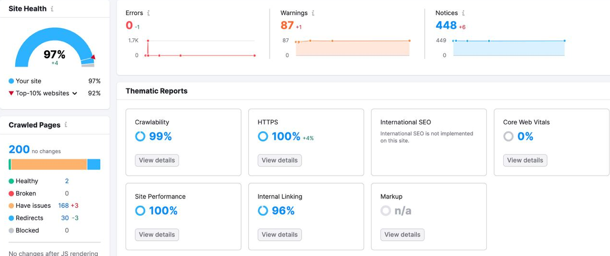

### Overview

<a href="https://acupower.co.uk/" target="_blank">Acupower company</a> provides an All-In-One Cloud ERP Solution to manage your business more efficiently.

While their main development team is focused on improving the ERP system,
Me and 2 of my developers took the landing/marketing website for development.

Our main goals for the website were:

- Optimize SEO from a technical perspective
- Fix admin panel to make good quality for editing of content
- Cleanup and refactor code to easily maintain in the future
- Fix Google Analytics-related issues

### Stack

Before starting on results and implementation, I want to highlight the technology stack we were working with:

- C#
- ASP.NET Core MVC
- Entity Framework Core
- MS SQL Server

### SEO

The initial reason why I started working with Acupower was SEO improvements from the technical side, and it kept being one of my priorities all along the way.

We used <a href="https://www.semrush.com/" target="_blank">Semrush</a> to analyze the SEO. It highlights a ton of details (more than any other SEO analyzer I have worked with before), and the Acupower already used it, so no need to change.

Here is the latest result we achieved: 97%. Which puts us above the top 10% of websites in terms of technical implementation of SEO.

Pushing SEO to high results from the technical side consists of many rather small changes. Not like with other features, where you just implement certain things and boom.

A big checklist for all future websites we develop was created. I will share it here, but keep it a secret for the best engineers.

SEO to-do list:

- https status code 301
- canonical meta tag to https
- meta title (max 60 letters)
- meta description (maximum 160 letters)
- meta image (1200px width and 630px height)
- meta keywords
- schema.org
- minify js and css files
- cache js and css files
- add alt to all images
- h1 should not be equal to the meta title
- sitemap.xml
- robots.txt
- descriptions and titles must be unique for each page
- defer scripts
- custom favicon
- add h1 and h2 to all pages
- og and twitter meta tags
- www subdomain

### Admin Panel

Because the old website was crafted in a hurry, we found a lot of challenging bugs inside the admin panel.

Auto-mapper is a ticking bomb of bugs. We rewrote almost all the functionality of updating and creating publications because of it.
Auto mappers introduce "black magic" that isn't checked at compile time and is hidden from developers.

An interface shouldn't be created just because there is a class. Interfaces, which will always have 1 implementation, create unnecessary complexity and make it harder to navigate the code.
I would say it is not only about interfaces, but about any abstraction. There were a couple of abstractions around database querying, which we completely got rid of.

From this moment on, the code was simple and straight-forward. ORM is enough abstraction already. There is no need for 7 layers of abstraction.

As a result, content editors were very satisfied with the admin panel. No more accident errors, which erase hours of your work.

### Google Analytics

While for my personal use I will choose open-source analytics like <a href="https://umami.is/" target="_blank">Umami</a> or <a href="https://plausible.io/" target="_blank">Plausible</a>, the Acupower was already relaying on GA, and it's integrated with Google Ads.

Figuring out how to integrate Umami with Google Ads is already on my to-do list, but let me tell you about GA.

I didn't like it much to work with. It's a heavy script that's a hassle to set up. You need a consent from users because Google Analytics requires cookies to work properly.

### Conclusion

We delivered a good work overall. CTO and content managers seem to be very satisfied with the results. We will continue to work with Acupower as new things are coming.

All this technical stuff we deal with on real-world websites makes me want to create a set of guides for painful problems.

So be tuned in if you want to level up as an engineer. If you're a founder, content creator, or company owner, then [contact me](/#contact), and we will see how my team can help.
